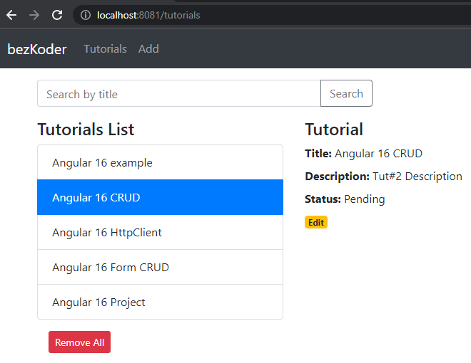

# Angular 16 nx migration project: SIMPLE BASIC

Build an Angular 16 App to then migrate it to nx.

Run `ng serve --port 8081` for a dev server. Navigate to `http://localhost:8081/`. 
**The app will automatically reload if you change any of the source files.

For instruction, please visit:
> [Angular 16 CRUD example with Rest API](https://www.bezkoder.com/angular-16-crud-example/)

More Practice:
> [Angular 16 Pagination example](https://www.bezkoder.com/angular-16-pagination-ngx/)

> [Angular 16 JWT Authentication & Authorization example](https://www.bezkoder.com/angular-16-jwt-auth/)

> [Angular 16 File upload example with Progress bar](https://www.bezkoder.com/angular-16-file-upload/)

> [Angular 16 Form Validation example](https://www.bezkoder.com/angular-16-form-validation/)
